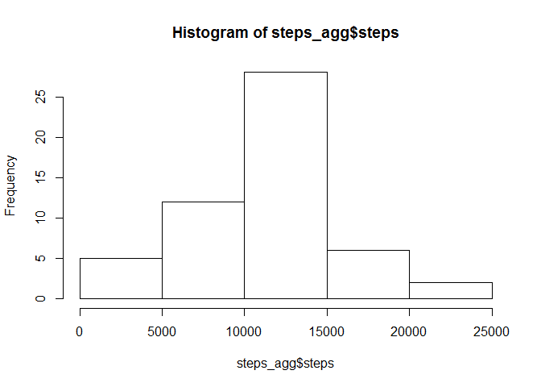

# Reproducible Research: Peer Assessment 1 - June 2015

## Loading and preprocessing the data
- Load the data into the steps data set:

```r
steps = read.csv("activity.csv")
```

- Aggregate the data into analysis chunks (removing all NA values):

```r
steps_agg <- aggregate(steps ~ date, data = steps, sum, na.rm = TRUE)
```

## What is mean total number of steps taken per day?
1. Make a histogram of the total number of steps taken each day:

```r
hist(steps_agg$steps)
```

 

2. Calculate and report the mean and median of the total number of steps taken per day:

*Calculations*  

```r
mean(steps_agg$steps)
```

```
## [1] 10766.19
```

```r
median(steps_agg$steps)
```

```
## [1] 10765
```

*Reporting*  
- The mean total number of steps taken per day is 1.0766189\times 10^{4}  
- The median total number of steps taken per day is 10765

## What is the average daily activity pattern?

1. Make a time series plot of the 5-minute interval and the average number of steps taken, averaged across all days:

```r
stepsinterval <- aggregate(steps ~ interval, data = steps, mean, na.rm = TRUE)
plot(steps ~ interval, data = stepsinterval, type = "l")
```

 

2. Which 5-minute interval, on average across all the days in the dataset, contains the maximum number of steps?


```r
stepsinterval[which.max(stepsinterval$steps), ]$interval
```

```
## [1] 835
```
This would be the 835 interval.

## Imputing missing values

1.Calculate and report the total number of missing values in the dataset:

```r
sum(is.na(steps$steps))
```

```
## [1] 2304
```
There are a total of 2304 rows that contain a NA value

2.Devise a strategy for filling in all of the missing values in the dataset:

```r
nasteps <- function(interval) 
            { stepsinterval[stepsinterval$interval == interval, ]$steps
             }
```

3.Create a new dataset that is equal to the original dataset but with the missing data filled in:

```r
stepsnew <- steps
count = 0
for (i in 1:nrow(stepsnew)) {
    if (is.na(stepsnew[i, ]$steps)) {
        stepsnew[i, ]$steps <- nasteps(stepsnew[i, ]$interval)
        count = count + 1
    }
}
cat("Total ", count, "NA values were filled.\n\r")
```

```
## Total  2304 NA values were filled.
## 
```

4.Make a histogram of the total number of steps taken each day and Calculate and report the mean and median total number of steps taken per day:


```r
stepsagg2 <- aggregate(steps ~ date, data = stepsnew, sum)
hist(stepsagg2$steps)
```

 

*Calculations*  

```r
mean(stepsagg2$steps)
```

```
## [1] 10766.19
```

```r
median(stepsagg2$steps)
```

```
## [1] 10766.19
```

*Reporting*  
- The mean total number of steps taken per day is 1.0766189\times 10^{4}  
- The median total number of steps taken per day is 1.0766189\times 10^{4}

Do these values differ from the estimates from the first part of the assignment? What is the impact of imputing missing data on the estimates of the total daily number of steps?

- The mean value has not changed, however there has been a very slight increase in the median value.
- There is a risk of the data being lowered, due to the lacking information for those intervals.

## Are there differences in activity patterns between weekdays and weekends?

1.Create a new factor variable in the dataset with two levels - "weekday" and "weekend" indicating whether a given date is a weekday or weekend day:


```r
stepsnew$day = ifelse(as.POSIXlt(as.Date(stepsnew$date))$wday%%6 == 0, "weekend", "weekday")
stepsnew$day = factor(stepsnew$day, levels = c("weekday", "weekend"))
```

2.Make a panel plot containing a time series plot of the 5-minute interval and the average number of steps taken, averaged across all weekday days or weekend days:


```r
stepsinterval2 <- aggregate(steps ~ interval + day, stepsnew, mean)
library(lattice)
xyplot(steps ~ interval | factor(day), data = stepsinterval2, aspect = 1/2, type = "l")
```

 
